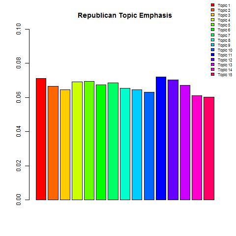
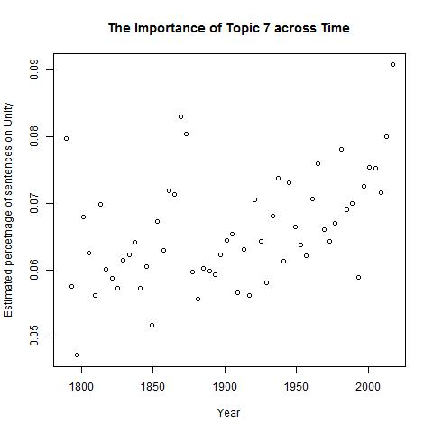

Controversy over Donald Trump's statements have overtaken the news media since the first Republican debate in August 2015. Since then, seemingly every news station has made claims about how unprecedented and unusual Donald's speech tone and content are. Unfortuantely, for many Americans, and espescially millenials, the speeches of Presidents before George W. Bush are not in recent memory, and therefore it is hard to develop a personal opinion on these claims. As such, our goal here is to examine trends in topics and tone across presidential speeches to help inform the dicussion of how the current President does or does not differ from his predecessors. Unfortuantely, because Mr. Trump has only given an inauguration speech thus far as President, that is all we can use to compare him to other Presidents. Readers should keep in mind that the Inauguration speech is not always indicative of future speeches or future policies. 

```{r, include = FALSE}

# setwd("C:/Users/Vikas/OneDrive/Cloud Workspace/Documents/Columbia/Senior/Applied Data Science/Project 1/Spr2017-Proj1-vikasarun/lib")

packages.used=c("tm", "tibble", "qdap", 
                "RColorBrewer","dplyr",
                "tm", "wordcloud", "tidytext", "readr", "topicmodels", "calibrate")

# check packages that need to be installed.
packages.needed=setdiff(packages.used, 
                        intersect(installed.packages()[,1], 
                                  packages.used))
# install additional packages
if(length(packages.needed)>0){
  install.packages(packages.needed, dependencies = TRUE)
}

# Load libraries
library(tm)
library(wordcloud)
library(RColorBrewer)
library(dplyr)
library(tidytext)
library(topicmodels)
library(qdap)
library(readr)
library(calibrate)


source("../lib/PlotTopicTimeSeries.R")
```


```{r, include = FALSE}
#Fetching data
folder.path="../data/InauguralSpeeches/"
speech.list=list.files(path = folder.path, pattern = "*.txt")

#Data cleaning
SpeechCorpus = Corpus(DirSource(folder.path))
SpeechCorpus = tm_map(SpeechCorpus, stripWhitespace)
SpeechCorpus = tm_map(SpeechCorpus, content_transformer(tolower))
SpeechCorpus = tm_map(SpeechCorpus, removeWords, stopwords("english"))
SpeechCorpus = tm_map(SpeechCorpus, removePunctuation)
SpeechCorpus = tm_map(SpeechCorpus, removeWords, character(0))
SpeechCorpus = tm_map(SpeechCorpus, stemDocument)
full.dtm = TermDocumentMatrix(SpeechCorpus)
full.td = tidy(full.dtm)

#Creating Lit of Dates
inaug.dates = read.table("../data/InauguationDates.txt", header = TRUE, sep = "\t" )
#Removing whitespace and punctuation to ensure consistent ordering of names
inaug.dates$PRESIDENT = gsub(" ", "", inaug.dates$PRESIDENT, fixed =TRUE)
inaug.dates$PRESIDENT = gsub(".", "", inaug.dates$PRESIDENT, fixed =TRUE)
inaug.dates = arrange(inaug.dates, PRESIDENT)
#Remove John Tyler, Millard Filmore, Andrew Johnson, Chester Arthur, First Teddy Roosevelt, First Calvin Coolidge, First Harry Truman, First LBJ, Gerald Ford,
inaug.dates = inaug.dates[c(-29,-32,-3,-7,-15),]
inaug.dates[c("36","6","18","30"), 2] = c("","","","")
dates = as.vector(as.matrix(t(inaug.dates[-1])))
dates = dates[dates != ""]
```

### Trump's Negativity (or lack thereof)

```{r, include = FALSE, warning = FALSE}

#Donald Trumps most positive words
afinn_strong_sentiments = get_sentiments("afinn")
afinn_strong_sentiments = filter(afinn_strong_sentiments, abs(score) >= 2)
colnames(afinn_strong_sentiments) = c("term", "score")
full.td = group_by(full.td, document)
full.td.score = inner_join(full.td, afinn_strong_sentiments)
full.td.score = arrange(full.td.score, desc(score))
as.data.frame(filter(full.td.score, document == "inaugDonaldJTrump-1.txt"))

#Sentiment Analysis on all Speeches. Finding average sentiment scores of top 10 most commonly used words
afinn_strong_sentiments = get_sentiments("afinn")
afinn_strong_sentiments = filter(afinn_strong_sentiments, abs(score) >= 2)
colnames(afinn_strong_sentiments) = c("term", "score")
full.td = group_by(full.td, document)
full.td.score = inner_join(full.td, afinn_strong_sentiments)
full.td.score = arrange(full.td.score, desc(count))
full.td.score = slice(full.td.score, 1:10)
full.scores = summarise(full.td.score, sum(count*score)/sum(count))

#Adding Dates to Sentiment Analysis Data, and ordering sentiment scores by date
full.scores$date = dates
colnames(full.scores) = c("document", "score", "date")
full.scores$date = as.Date(full.scores$date, format = "%m/%d/%Y")
full.scores = arrange(full.scores, date)
photo.name = "../figs/TimeSeriesSentimentScore.jpg"
jpeg(filename = photo.name)
plot(full.scores$date, full.scores$score, xlab = "Year of Speech", ylab = "Sentiment score [-5, 5]", main = "Average Sentiment Scores for all Inauguration Speeches")
dev.off()

#Find second term presidents, mark them on graph to help with visualization
second.term.bool = grepl("*2.txt", full.scores$document)
second.term.scores = full.scores
second.term.scores$termIndicator = second.term.bool
second.term.scores = filter(second.term.scores, termIndicator == TRUE)
second.term.names = substr(second.term.scores$document, 6, nchar(second.term.scores$document)-6)
photo.name = "../figs/TimeSeriesSentimentScore2.jpg"
jpeg(filename = photo.name)
plot(full.scores$date, full.scores$score, xlab = "Year of Speech", ylab = "Sentiment score [-5, 5]", main = "Average Sentiment Scores for all Inauguration Speeches")
points(second.term.scores$date, second.term.scores$score, pch = 3, col = "Red")
dev.off()
```
As soon as Trump's inauguration speech had concluded, numerous organizations came to the conclusion that it was an unusually negative speech, calling it ["American Carnage"](http://www.thedailybeast.com/articles/2017/01/20/donald-trump-s-american-cranage-inaugural.html) and a ["declaration of Political War"](https://www.theguardian.com/commentisfree/2017/jan/20/the-guardian-view-on-donald-trumps-inauguration-a-declaration-of-political-war). In order to examine this claim, we analyzed the sentiment of every inaguration speech ever given. Using the [AFINN](http://neuro.imm.dtu.dk/wiki/AFINN) method of scoring, we scored the words of the speeches on a scale from -5 (e.g, bastard) to 5 (e.g, superb). Averaging the non-neutral scores resulted in the graph below. 


Almost immediately, once notices that Donald Trump's speech (the rightmost data point), is ranked the third most positive speech since 1900, which certainly goes against the general media perception. As such, even though people might percieve his content as negative, it seems like attacking Trump on his word choice and tone in his speeches is unfair. It is worth nothing that the two words with the highest positive score were "triumph" and "win", which could be viewed as negative depending on context and one's political beliefs. However, even when throwing out these terms, Trump's speech is still scored as very positive. 
```{r, include = FALSE}
#Splits speeches into sentences to prepare for topic mining
full.text = as.data.frame(matrix(nrow=length(speech.list), ncol = 2))
colnames(full.text) = c("text", "filename")
for(i in 1:length(speech.list))
{
  current.path = paste(folder.path, speech.list[i], sep = "")
  full.text[i,1] = read_file(current.path)
}
full.text[,2] = speech.list


sentence.list=NULL
for(i in 1:length(speech.list))
{
  sentences=sent_detect(full.text$text[i],
                        endmarks = c("?", ".", "!", "|",";"))
  if(length(sentences)>0)
  {
    # colnames(emotions)=paste0("emo.", colnames(emotions))
    # in case the word counts are zeros?
    sentence.list=rbind(sentence.list, 
                        cbind(speech.list[i],
                              sentences=as.character(sentences), 
                              sent.id=1:length(sentences)
                        )
    )
  }
}
colnames(sentence.list) = c("filename", "sentences", "sent.id")
sentence.list = as.data.frame(sentence.list)

#Create Corpus of Sentence Snippets
corpus.list=sentence.list[2:(nrow(sentence.list)-1), ]
sentence.pre=sentence.list$sentences[1:(nrow(sentence.list)-2)]
sentence.post=sentence.list$sentences[3:(nrow(sentence.list)-1)]
corpus.list$snipets=paste(sentence.pre, corpus.list$sentences, sentence.post, sep=" ")
rm.rows=(1:nrow(corpus.list))[corpus.list$sent.id==1]
rm.rows=c(rm.rows, rm.rows-1)
corpus.list=corpus.list[-rm.rows, ]
docs <- Corpus(VectorSource(corpus.list$snipets))
#writeLines(as.character(docs[[sample(1:nrow(corpus.list), 1)]]))

#Clean Corpus of Sentence Snippets
docs <-tm_map(docs,content_transformer(tolower))
docs <- tm_map(docs, removePunctuation)
docs <- tm_map(docs, removeNumbers)
docs <- tm_map(docs, removeWords, stopwords("english"))
docs <- tm_map(docs, stripWhitespace)
docs <- tm_map(docs,stemDocument)

```
### Unity, Patriotism, and Destiny

If Trump's speech is more positive than that of most other Presidents, what makes him such a polarizing candidate? To help answer this question we divided the speeches into chunks of sentences and used machine learning algorithms to find topics, which are sets of words that generally appeared together.
```{r, include = FALSE}
#Create DTM
dtm <- DocumentTermMatrix(docs)
#convert rownames to filenames#convert rownames to filenames
rownames(dtm) <- paste(corpus.list$type, corpus.list$File,corpus.list$Term, corpus.list$sent.id, sep="_")
rowTotals <- apply(dtm , 1, sum) #Find the sum of words in each Document
dtm  <- dtm[rowTotals> 0, ]
corpus.list=corpus.list[rowTotals>0, ]

#Performing 15 Topic Model using LDA
burnin <- 4000
iter <- 2000
thin <- 500
seed <-list(2003,5,63,100001,765)
nstart <- 5
best <- TRUE

#Number of topics
k <- 15

#Run LDA using Gibbs sampling
ldaOut <-LDA(dtm, k, method="Gibbs", control=list(nstart=nstart, 
                                                  seed = seed, best=best,
                                                  burnin = burnin, iter = iter, 
                                                  thin=thin))
#write out results
#docs to topics
ldaOut.topics <- as.matrix(topics(ldaOut))
table(c(1:k, ldaOut.topics))
write.csv(ldaOut.topics,file=paste("../output/LDAGibbs",k,"DocsToTopics.csv"))

#top 6 terms in each topic
ldaOut.terms <- as.matrix(terms(ldaOut,20))
write.csv(ldaOut.terms,file=paste("../output/LDAGibbs",k,"TopicsToTerms.csv"))

#probabilities associated with each topic assignment
topicProbabilities <- as.data.frame(ldaOut@gamma)
write.csv(topicProbabilities,file=paste("../output/LDAGibbs",k,"TopicProbabilities.csv"))

terms.beta=ldaOut@beta
terms.beta=scale(terms.beta)
topics.terms=NULL
for(i in 1:k){
  topics.terms=rbind(topics.terms, ldaOut@terms[order(terms.beta[i,], decreasing = TRUE)[1:7]])
}
topics.terms
ldaOut.terms

topics.hash=c("Economy", "America", "Defense", "Belief", "Election", "Patriotism", "Unity", "Government", "Reform", "Temporal", "WorkingFamilies", "Freedom", "Equality", "Misc", "Legislation")

#Function in for loop defined in PlotTopicTimeSeries.R in ../lib
for(i in 1:length(topics.hash))
{
  PlotTopicTimeSeries(corpus.list, topicProbabilities, i, topics.hash[i], dates)
}

#PLotting topic assignments per president, function is in PlotTopicTimeSeries.R in ../lib
CreatePresidentPieCharts_15(corpus.list, topicProbabilities, dates, topics.hash)

#AddingPartyAssignments
party.list = read.csv("../data/InaugurationInfo.csv", header=TRUE)
party.list = mutate(party.list, name = paste(File, Term, sep="-"))
party.list = dplyr::select(party.list, Party, name)
party.list = arrange(party.list, name)

#This function si defined in PlotTopicTimeSeries.R in ../lib
CreatePartyCharts(corpus.list, party.list, topicProbabilities, topics.hash, dates)

```
In many categories Trump does not appear to deviate much from the topic emphasis of previous Presidents. However, there are two major exceptions to this rule. The first one is the topic 8.


When looking at Presidents from the Cold War period onwards, we notice that the last two speeches, namely Barack Obama and Donald Trump, place a significantly higher than normal emphasis on this topic. This topic appears to be about destiny, as it contains keywords such as:

* great
* change
* hope
* fear
* achieve

To give an idea of how rare it is for a Republican candidate to use these words, consider the following chart, illustrating the average distribution of topics for Republican candidates.



One will notice that the average Republican spends about 6% of their time speaking explicitly about destiny while Trump spends one third more time than this, at 8%. This 33% increase represents a large deviation from the traditional Republican dialogue. This appears to line up with Donald Trump's aim of changing the course of the USA to make it "great" and powerful again. It also lines up well with the second topic, one where Trump is a much more obvious outlier. 



Trump in clearly the front runner in emphasizing topic 7, which appears to focus on patriotism and unity. Important words for topic 7 include

* country
* common
* everyone
* sacrifice 
* require
* give

Further inspection of the graph reveals that, prior to Trump, Obama was the president who focused most on unity and patriotism in recent memory. Furthermore we notice that Bill Clinton's second speech (the low dot around the year 2000) focuses the least on unity. As such, over the span of 20 years, citizens, and many millenials, have seen an unprecedent spike in the emphasis on unity in presidential speeches. To add insult to injury, the difference between the amount of time Obama spent on the unity in 2013 and the amount of time Trump spent on the unity in 2017 is the biggest leap in increased patriotism and unity ever observed! 

As such, this trends seems to be the most drastic identifiable change in the makeup of Trump's inauguration speech. It follows a trend that we have been seeing in the 21st century, but takes it to a never before seen level. When combining this with the unusually high amount of time spent talking about destiny, we can interpret this by saying Trump appears to be the taking next large step in a new, more nationalist America. That step that seems to be what makes him different than other presidents, and therefore makes him either a welcome change or a scary step in the wrong direction. 

And while that is a useful result of this data analysis, perhaps a more useful result is the idea that Trump is not actually as different from past candidates as we like to think he is. His official speeches seem (thus far) just as positive, and his focus on most topics seems to be similar to that of other candidates. Thus, while the increased emphasis on unity, patriotism, and destiny might catch some of us off guard, it might be useful for many Americans to consider that he isn't quite as "unprecedent" as people like to think.